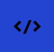
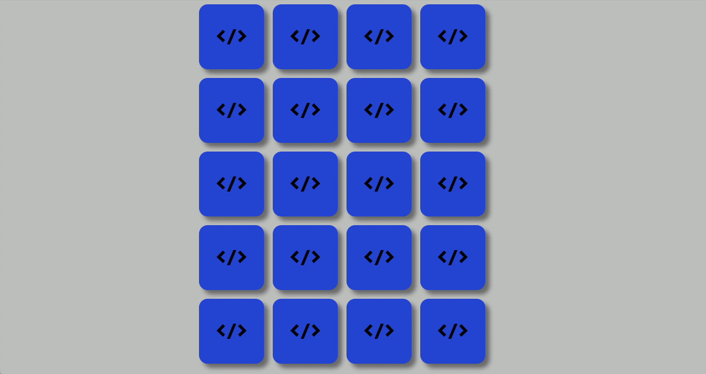
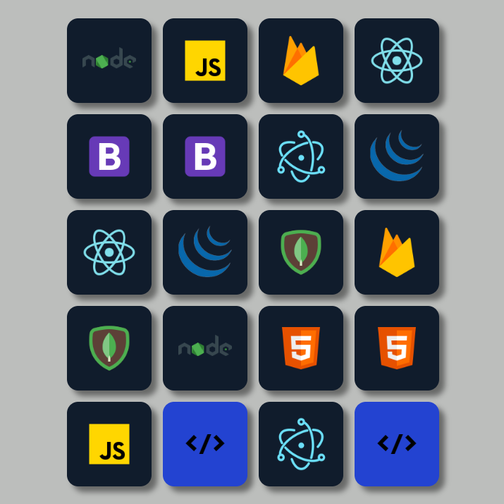
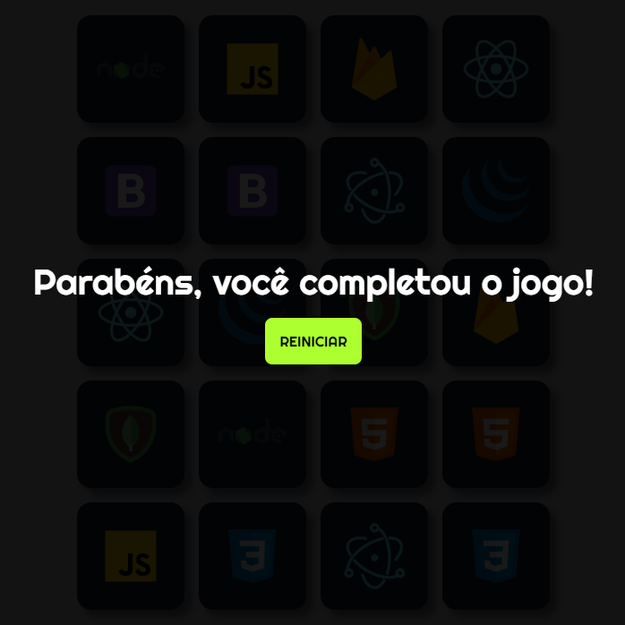

<div align="center">
  
</div>


<h1 align='center'>
 <p>Memory Game</p>
</h1>

<div align="center">
   
<div align="center">
   
   
</div>
</div>


### 📕 About

Jogo da memória com cartões de linguagens de programação, para se divertir e se superar no tempo!

#

### ❓ Why the app

O projeto jogo da memoria foi um dos projetos de JavaScript que fiz do curso PROGRAMADAOR BR no ano de 2022.

#

### ⛏️ Tools used

- [HTML](https://developer.mozilla.org/en-US/docs/Web/HTML)
- [CSS](https://developer.mozilla.org/en-US/docs/Web/CSS)
- [JavaScript](https://developer.mozilla.org/pt-BR/docs/Web/JavaScript)

#

### 🤝🏽 How to contribute

You need to have [Node](https://nodejs.org/en/download), [Git](https://git-scm.com/download/win) and [VsCode](https://code.visualstudio.com/download) installed on your computer.

#### Siga o passo a passo:

````bash
    # Clone the project
    $ git clone git@github.com:dan-ia/MemoryGame.git

    # Enter directory
    $ cd MemoryGame
````
````bash
    # Install the dependencies, if use npm
    $ npm install
````
<p align="center">or</p>

````bash
    # Install the dependencies, if use yarn
    $ yarn
````

```` bash
     # Open project in VsCode
     code .
````
<div align="center">

<h3> Any questions? Contact me! 🩵✌️</h3>

[](https://www.linkedin.com/in/dan-ia/)
[](mailto:danieillsilvarv411@gmail.com)


</div>

